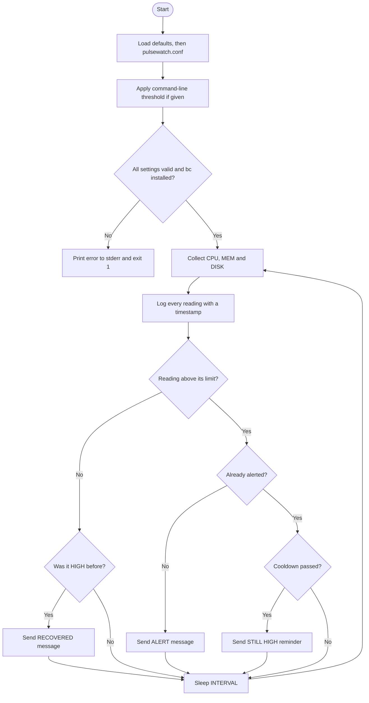

# PulseWatch

**A lightweight Linux server monitor written in Bash. It watches CPU, memory and disk, timestamps every reading, and flags anything above its own configurable limit.**


---

## Table of Contents

1. [Why PulseWatch](#why-pulsewatch)
2. [Features](#features)
3. [Quick Start](#quick-start)
4. [Usage](#usage)
5. [Configuration](#configuration)
6. [Sample Output](#sample-output)
7. [How It Works](#how-it-works)
8. [Design Decisions](#design-decisions)
9. [Testing](#testing)
10. [Known Limitations](#known-limitations)
11. [Roadmap](#roadmap)
12. [My Learning](#my-learning)

---

## Why PulseWatch

When a server runs out of CPU, memory or disk, the team usually finds out from users, not from the server. PulseWatch is a small, dependency-light monitor that checks the basics on a fixed interval and records what it saw with a timestamp, so there is always a trail to investigate.

It is also a learning project. I am building it step by step to practise DevOps fundamentals (Linux, Bash, Git, monitoring, alerting, cloud deployment) with professional engineering habits: small commits, tests, input validation and documented decisions.

## Features
````markdown
- **CPU, memory and disk monitoring** in one loop
- **Separate limit per metric**, set in a config file (for example disk 90%, CPU 80%)
- **Command-line override**: one number sets every limit at once
- **Layered settings** with a clear order: defaults, then config file, then command line
- **Input validation** for limits, interval and cooldown, with clear errors on stderr and meaningful exit codes
- **Dependency check** that fails fast if `bc` is missing
- **Timestamped logging** to the screen and to `pulsewatch.log`, plus a startup line that records the active settings
- **Alert messages built for fast reading**: severity first, then server, time, value against limit, and one concrete next action
- **Alert cooldown**: one alert per problem, a reminder if it persists, and a recovery notice, so one spike does not flood the team
- **One reusable status function** (`check_metric`) applied to every metric
- **24 automated tests** across two suites
````

## Quick Start

**Requirements:** Linux (Ubuntu tested, including WSL2), Bash, and `bc`.

```bash
# 1. Clone
git clone git@github.com:Maryam-Ikhlaq-se/pulse-watch.git
cd pulse-watch

# 2. Install the one dependency
sudo apt install bc

# 3. Run
./monitor.sh
```

Stop the monitor at any time with `Ctrl + C`.

## Usage

```bash
./monitor.sh [threshold]
```

| Argument    | Description                                                              | Default                |
|-------------|--------------------------------------------------------------------------|------------------------|
| `threshold` | Optional whole number from 1 to 100. Overrides every limit in the config | Limits from the config |

```bash
./monitor.sh        # use the limits in pulsewatch.conf
./monitor.sh 90     # every metric alerts above 90%
./monitor.sh abc    # error: threshold must be a whole number from 1 to 100
```

The monitor runs until you stop it.

**Exit codes**

| Code | Meaning                                                              |
|------|----------------------------------------------------------------------|
| `1`  | Invalid threshold, limit or interval, or a required tool is missing  |

## Configuration

Settings are read from `pulsewatch.conf`, which sits next to `monitor.sh`:
```bash
CPU_LIMIT=80
MEM_LIMIT=80
DISK_LIMIT=90
INTERVAL=5
COOLDOWN=300
LOG_FILE="pulsewatch.log"
```
 
| Variable     | Purpose                                                          | Default          |
|--------------|------------------------------------------------------------------|------------------|
| `CPU_LIMIT`  | CPU percentage above which CPU is HIGH                           | `80`             |
| `MEM_LIMIT`  | Memory percentage above which MEM is HIGH                        | `80`             |
| `DISK_LIMIT` | Disk percentage above which DISK is HIGH                         | `90`             |
| `INTERVAL`   | Seconds between readings                                         | `5`              |
| `COOLDOWN`   | Minimum seconds between repeat messages for the same ongoing problem | `300`        |
| `LOG_FILE`   | File that readings are appended to                               | `pulsewatch.log` |
````
**Order of precedence** (the most specific source wins):

1. Built-in defaults
2. `pulsewatch.conf`
3. Command-line threshold (applies to all three limits)

To use a different config file, set `PULSEWATCH_CONF`:

```bash
PULSEWATCH_CONF=/path/to/other.conf ./monitor.sh
```

If the config file is missing, the defaults are used. If it contains an invalid value, the monitor refuses to start and names the bad variable.

## Sample Output

Using separate limits (CPU 1%, MEM 100%, DISK 100%) to show that each metric is judged on its own:

```text
2026-10-10 12:37:51 PulseWatch started - limits: CPU 1%, MEM 100%, DISK 100%, interval 5s
2026-10-10 12:37:57 CPU: 3.2% - HIGH
2026-10-10 12:37:57 MEM: 5.9% - NORMAL
2026-10-10 12:37:57 DISK: 1% - NORMAL
```
````markdown
Alert messages. A message is sent once when a metric first goes above its limit, a reminder follows if it is still high after the cooldown, and a recovery notice is sent when it returns to normal. Every reading is still logged. Real output with `MEM_LIMIT=1`, `INTERVAL=1` and `COOLDOWN=5`:
 
```text
2026-10-10 14:12:59 MEM: 5.9% - HIGH
🔴 ALERT: MEM HIGH
Server: my-server
Time: 2026-10-10 14:12:59
MEM: 5.9% (limit 1%)
Check first: run 'ps aux --sort=-%mem | head' to find the largest process
 
2026-10-10 14:13:00 MEM: 6.0% - HIGH
2026-10-10 14:13:01 MEM: 6.0% - HIGH
2026-10-10 14:13:06 MEM: 6.0% - HIGH
🟠 STILL HIGH: MEM
Server: my-server
Time: 2026-10-10 14:13:06
MEM: 6.0% (limit 1%)
Since: 14:12:59
Check first: run 'ps aux --sort=-%mem | head' to find the largest process
```
 The recovery message has this format (covered by the unit tests):
 ```text
✅ RECOVERED: MEM
Server: my-server
Time: 2026-10-10 14:20:00
MEM: 5.0% (limit 10%)
Was high since: 14:12:59
```
````

Invalid configuration:

```text
$ PULSEWATCH_CONF=/tmp/bad.conf ./monitor.sh; echo $?
Error: CPU_LIMIT must be a whole number from 1 to 100 (got 'abc').
Usage: ./monitor.sh [threshold]
1
```

## How It Works
````markdown

 
The decision part (from "Reading above its limit?" onward) runs separately for each of CPU, MEM and DISK, so each metric has its own state.
 
**Code structure** (`monitor.sh`)
 
| Part                | Responsibility                                                              |
|---------------------|-----------------------------------------------------------------------------|
| Defaults and config | Sets defaults, then loads `pulsewatch.conf` over them                       |
| `validate_limit()`  | Checks a value is a whole number from 1 to 100, or exits with an error      |
| `validate_seconds()`| Checks `INTERVAL` and `COOLDOWN` are whole seconds, 1 or more               |
| Validation block    | Applies the command-line override, validates every setting, checks for `bc` |
| State arrays        | `METRIC_STATE`, `INCIDENT_START` and `LAST_ALERT` remember each metric between readings |
| `now_epoch()`       | Returns the current time in seconds (its own function so tests can fake the clock) |
| `log()`             | Adds a timestamp and writes to screen and file with `tee -a`                |
| `get_cpu()`         | Reads CPU usage as 100 minus idle, parsed from `top`                        |
| `get_memory()`      | Reads used / total memory from `free` as a percentage                       |
| `get_disk()`        | Reads root disk usage from `df /`                                           |
| `build_alert()`     | Builds the ALERT, REMINDER or RECOVERED message text                        |
| `send_alert()`      | Delivers the message. Currently prints to the terminal; a real channel replaces only this function |
| `check_metric()`    | Logs every reading and decides whether a message is needed                  |
| `main()`            | The monitoring loop                                                         |
| Guard at the bottom | Runs `main` only when the script is executed directly, so tests can load the functions |
````
 ---
**CPU pipeline explained**

```text
top -bn1                  one snapshot of system stats
| grep "Cpu(s)"           keep only the CPU line
| sed '...'               extract the idle percentage
| awk '{print 100 - $1}'  used = 100 - idle
```

## Design Decisions

| Decision | Why |
|----------|-----|
| **Functions per metric** | Each metric lives in one named place. Adding disk took a new function and two lines in the loop, with no change to the CPU or memory code (separation of concerns). |
| **`check_metric` instead of repeated `if` blocks** | One place decides HIGH or NORMAL for every metric (DRY). The future alert sender only needs to be added here. |
| **Config file instead of hard-coded limits** | Operators change limits without editing code, and different servers can have different limits. Disk and CPU rarely share the same sensible threshold. |
| **Defaults, then config, then command line** | The standard layering used by real tools. The most specific source wins, so a quick test never needs a file edit. |
| **`PULSEWATCH_CONF` environment variable** | Lets tests and one-off runs use a different config without touching the real one. |
| **One `validate_limit` function** | The same rule applies to the command line and to the config file, defined once. |
| **Validate everything at startup** | A bad config is rejected before the loop starts, not discovered halfway through a run. |
| **`bc -l` for comparisons** | Bash cannot compare decimals like `2.1`. `bc` can. |
| **Errors to stderr (`>&2`) and `exit 1`** | Keeps errors separate from normal output, and lets cron or other tools detect failure. |
| **`10#` prefix on numbers** | Stops Bash reading values like `08` as octal. |
| **`tee -a` logging** | Operators see readings live and the file keeps the history. |
| **Log files excluded by `.gitignore`** | Logs are generated data: they change constantly, grow without limit, and can leak server details into a public repo. |
| **Config file holds limits only** | It is safe to commit. Secrets such as API keys will live in a separate `.env` file that Git ignores. |
| **Conventional Commits** | `feat:`, `fix:`, `refactor:`, `test:`, `docs:` keep the history readable and searchable. |
````markdown
| **Alert once, remind later, announce recovery** | A flood of identical messages gets ignored (alert fatigue). One message per change keeps each alert meaningful, and the reminder stops a long problem from being forgotten. |
| **Per-metric state kept in memory** | The monitor must remember what it already reported. Associative arrays keep this simple, with no extra files to manage. |
| **`build_alert` separate from `send_alert`** | The wording and the delivery channel change independently. Swapping the channel touches one function. |
| **Message order: severity, where and when, value against limit, next action** | Readable at a glance on a phone, even out of context and at 3 AM. |
| **`now_epoch` as its own function** | Tests replace it with a fake clock, so a 5-minute cooldown is tested in milliseconds. |
| **Loop runs only when the script is executed directly** | Tests can load the functions without starting an endless loop. |
| **Alert channel decision kept open** | Options are the WhatsApp Cloud API (free test number, but approved templates and paid production use), a Telegram bot, or email through AWS SNS. Because delivery lives in `send_alert`, the choice does not affect the rest of the code. |
````
## Testing
````markdown
There are two suites, 24 tests in total. Run both from the project folder:
 
```bash
./test.sh
./test_alerts.sh
```
 
**`test.sh`: the whole script (10 tests)**
 
| Test                              | Expectation                                   |
|-----------------------------------|-----------------------------------------------|
| Non-numeric threshold (`abc`)     | Rejected with exit code 1                     |
| Threshold `0`                     | Rejected with exit code 1                     |
| Threshold `101`                   | Rejected with exit code 1                     |
| Negative threshold (`-5`)         | Rejected with exit code 1                     |
| Threshold `1`                     | MEM reported HIGH                             |
| Threshold `100`                   | No HIGH reported                              |
| Config: limits are independent    | Only the metric above its own limit is HIGH   |
| Config: bad value                 | Rejected with exit code 1                     |
| Command line overrides config     | A command-line value beats the config file    |
| Config file missing               | Built-in defaults are used                    |
 
**`test_alerts.sh`: the alert logic (14 tests)**
 
| Area                  | What is checked                                                                 |
|-----------------------|----------------------------------------------------------------------------------|
| One full incident     | First HIGH sends one alert; nothing new inside the cooldown; a reminder after the cooldown; the cooldown restarts after a reminder |
| Recovery              | A recovery message is sent once, and a new problem afterwards alerts again       |
| Separate metrics      | CPU alerts independently of MEM; a normal reading sends nothing                  |
| Message content       | The message names the server, says what to check first, and shows the value against its limit |
 
Both suites print a PASS or FAIL line per test and a summary, and exit non-zero if anything fails, so they can be dropped into a CI pipeline later.
 
Notes on how the tests are written:
 
- `timeout 3` stops the endless monitoring loop after the first reading (in `test.sh`).
- Each check reads one log line at a time (`grep -q "MEM:.*HIGH"`), so a result cannot pass by matching across two different lines.
- Tests use a temporary config file (`mktemp`, removed automatically with `trap`) and never touch the real `pulsewatch.conf`.
- `test_alerts.sh` loads the functions with `source` and replaces the clock with a fake one, so cooldown behaviour is tested instantly instead of waiting minutes.
````
 ---

## Known Limitations
````markdown
- **WSL2 reports the Linux VM only.** On a laptop running WSL2, `top` sees processes inside Ubuntu, not Windows apps. On a real Linux server it covers the whole machine. The 1% disk reading is also a virtual disk.
- **The monitor watches the machine it runs on.** It is a local agent, not a remote prober.
- **Alerts are not delivered anywhere yet.** `send_alert` prints to the terminal. The delivery channel is still being chosen (see the roadmap).
- **Alert state lives in memory.** Restarting the monitor forgets ongoing problems, so it may alert again for a problem that was already reported.
- **No flapping protection.** A metric that hovers around its limit can alternate between ALERT and RECOVERED. A margin below the limit before declaring recovery would fix this.
- **Reminders can be up to one reading late.** The cooldown is a minimum wait, and it is checked once per reading.
- **`top` output parsing is format-dependent.** The `sed` expression assumes the standard procps `Cpu(s)` line found on Ubuntu.
- **Only the root filesystem (`/`) is checked.**
- **The config file is executed as shell code** (`source`). Only use config files you wrote yourself.
- **A relative `LOG_FILE` depends on the folder you run the script from.** An absolute path avoids this.
- **`pulsewatch.log` grows without limit.** Log rotation is planned.
````
 ---
## Roadmap
 
````markdown
- [x] Linux (WSL2), Git and GitHub with SSH authentication
- [x] CPU monitoring loop
- [x] Configurable threshold argument
- [x] Input validation and dependency check
- [x] Timestamps and log file
- [x] Memory and disk monitoring as separate functions
- [x] Shared `check_metric` function
- [x] Automated tests
- [x] Per-metric limits in a config file
- [x] Alert message builder (severity, where and when, value against limit, next action)
- [x] Alert cooldown with reminders and recovery notices
- [x] Unit tests for the alert logic with a fake clock
- [ ] Alert delivery to a phone (channel being decided: WhatsApp, Telegram or email)
- [ ] Secrets in a `.env` file kept out of Git
- [ ] Flapping protection
- [ ] Scheduled run with cron or systemd
- [ ] Log rotation
- [ ] Deployment on AWS EC2
- [ ] Architecture diagram and a screenshot of a real alert
````

---

## My Learning

This section is my engineering journal for the project: what I built, what broke, how I diagnosed it, and what it taught me.

### Journey so far

1. Set up Ubuntu on WSL2, installed and configured Git, created the GitHub repository.
2. Wrote the first CPU monitor and tested the NORMAL and HIGH paths.
3. Made the threshold a command-line argument.
4. Added validation, exit codes and a dependency check.
5. Added timestamps and file logging.
6. Refactored CPU into a function, then added memory and disk.
7. Introduced `check_metric` to remove duplicated logic.
8. Wrote an automated test script.
9. Wrote this README, including a flow diagram.
10. Moved the limits into a config file with one limit per metric.
11. Extended the test suite from 6 to 10 tests to cover the config behaviour.
````markdown
12. Built the alert message builder, with the most important information first.
13. Added a cooldown: one alert per problem, a reminder if it continues, and a recovery notice.
14. Wrote a second test suite (14 tests) that uses a fake clock to test timing instantly.
15. Compared alert delivery options (WhatsApp Cloud API, Telegram bot, email through AWS SNS) on cost, setup effort and limits, and asked a senior for advice.
````

### Technical concepts I learned

**Linux and Bash**
- Shell scripting basics: variables, `while` loops, `if` blocks, functions and `local` variables.
- Parameter defaults with `"${1:-80}"` and `"${VAR:-default}"`.
- Pipelines: how `top | grep | sed | awk` passes each step's output to the next.
- Why Bash cannot compare decimals, and how `bc -l` solves it.
- `stdout` versus `stderr`, and why errors go to `>&2`.
- Exit codes: `0` is success, anything else is failure, and `echo $?` reads the last one.
- Octal pitfalls: why `10#$VALUE` matters for numbers like `08`.
- `tee -a` for writing to screen and file at once.
- `command -v` for checking that a tool exists.
- `source` to load a config file, and why that means the file is trusted code.
- `bash -n` to check syntax without running a script.
- `${BASH_SOURCE[0]}` to find the folder a script lives in.
- `mktemp` and `trap ... EXIT` for temporary files that clean up after themselves.
- `timeout` for stopping an endless loop inside a test.
- Heredocs (`cat > file << 'EOF'`) for writing a whole file from the terminal.
````markdown
- Associative arrays (`declare -A`) to remember a value per name, such as the state of each metric.
- `printf` for formatted, multi-line messages, and `$'\n'` for a newline inside a string.
- `date +%s` for time in seconds, and `date -d "@seconds"` to turn it back into a readable time.
- A guard (`if [[ "${BASH_SOURCE[0]}" == "$0" ]]`) so a script can be loaded by a test without running its main loop.
````

**Git and GitHub**
- Basic flow: `status`, `add`, `commit`, `push`, `pull`, `log --oneline`.
- SSH authentication with an ed25519 key pair: the public key goes on GitHub, the private key never leaves the machine.
- Conventional Commits and writing in the imperative mood.
- `git commit -am` stages tracked, modified files only. New files still need `git add`.
- `.gitignore`: commit what you write, not what the program produces (logs) and never secrets.
- A commit is local until you push. Uploading a file on the GitHub website puts the remote ahead of your machine, so run `git pull` before the next push.
- Do not rewrite pushed history just to fix a typo in a message.

**Configuration and design**
- Layered configuration: defaults, then file, then command line.
- Validating the same rule once and reusing it everywhere.
- Keeping limits (safe to commit) apart from secrets (never committed).
````markdown
**Alerting and state**
- Alert fatigue: repeated identical alerts get ignored, so a good monitor speaks only when something changes.
- A small state machine: new problem, ongoing problem, recovered. Each reading moves a metric between states, and only some moves send a message.
- Separating what to say (`build_alert`) from where to send it (`send_alert`).
- Message design for a tired reader: severity first, then where and when, then the value against its limit, then one next action.
- Comparing delivery channels honestly: a free test tier is not the same as free production use, templates may be required, and test tokens can expire.
````

**Testing**
- A test that can pass for the wrong reason is not proof. Matching one line at a time is stricter than matching a whole blob of output.
- A refactor must keep every old test green.
- Tests should clean up after themselves and never touch real configuration.
````markdown
- Replace the clock with a fake one so time-based behaviour (a 5-minute cooldown) is tested in milliseconds.
- Unit tests check one function in isolation; integration tests run the whole script. Both have a place.
- Code that cannot be loaded without running is hard to test. Designing for testability is a design decision.
````

**Monitoring concepts**
- CPU usage is 100 minus idle.
- Memory usage is used divided by total.
- A monitor you have never seen alert is untested, so always trigger the HIGH path on purpose.
- WSL2 is a lightweight VM, so it monitors Ubuntu, not Windows.
````markdown
- A monitor runs on the machine it watches. A "server" only means a Linux machine running services, so the same script monitors my laptop's Ubuntu today and a cloud server later.
````

### Problems I hit and how I solved them

| Problem | Cause | Fix and lesson |
|---------|-------|----------------|
| `Permission denied (publickey)` on `git push` | GitHub had no SSH key for this machine | Generated an ed25519 key and added the public key to GitHub. Read the real error line, not the first scary one. |
| Typed a command into the `ssh-keygen` file-name prompt | Every prompt takes its own input | Commands go only at the `$` prompt. Cancel with `Ctrl+C` and restart. |
| `top: bad iterations argument` | Typed `-bnl` (letter L) instead of `-bn1` (number 1) | Letter `l` and number `1` look alike in a terminal font. Read error messages literally. |
| `awk` printed wrong values | Typed `$l` instead of `$1` | Same look-alike problem. |
| `sed: unknown command` and an empty CPU value | A `'...'` placeholder was left in the `sed` expression | Never leave placeholders. Always test after every edit. |
| Garbled lines and a stray `EOF` in the file | Pasted a heredoc inside nano instead of at the `$` prompt | Know which program has focus before pasting. Replace the file from the prompt. |
| `syntax error: unexpected end of file` | Missing closing `}` on a function | Every `{` needs a `}`. Read the line number in the error, and run `bash -n` before running. |
| A stray pipe character in front of a log message | Bash treated the message as a command | Re-read code character by character when behaviour is odd. |
| `sudo apt insatll bc` in an error message | Typo in a message users will copy and paste | Messages are part of the product. Proofread them. |
| `df -h/` returned `invalid option` | Missing space before `/` | Spacing matters in the shell. |
| `DISK: 1% - NORMAL` at threshold 1 | The check is strictly greater than: 1 is not above 1 | My expectation was wrong, not the code. Check the rule before blaming the program. |
| `CPU: 0% - NORMAL` at a limit of 1 | An idle CPU fluctuates, so it only crosses a low limit on some readings | Predict behaviour from the rule, not from a single run. |
| `cat pulsewatch.log` said no such file | I had said "done" before the logging code existed | Do not assume a step is finished. Verify with evidence (output, `git status`, `git log`). |
| Typo "continous" in an early commit | Skipped proofreading | Fix forward. Proofread messages from then on. |
| Mermaid diagram showed as raw code on GitHub | Unquoted labels (one with a colon) broke the parser | Quote every label. A diagram that renders in one tool may not render in another, so check the real page. |
| GitHub website was unavailable | Outage on the web interface | Git over SSH is a separate path from the website. Editing locally and pushing kept me working. |
| Remote was ahead after uploading a file on the website | A commit existed on GitHub that my machine did not have | Run `git pull` before pushing. |
| Scrambled text in the terminal after pasting a long block | Display glitch from pasting a large heredoc | Do not trust the display alone. Verify with `bash -n`, `grep` for stray `EOF`, and the exit code. |
| Said "committed" but had not pushed | A commit is local until pushed | Finish with `git push` and `git status` every time. |
````markdown
| First reminder arrived 7 seconds after the alert, not 5 | The cooldown is a minimum, it is only checked once per reading, and each reading cycle takes over a second | Read timing rules as "at least", and measure the real cycle time before calling something a bug. |
| Could not trigger the recovery message by hand | Memory usage is hard to push down on demand | Tests with a fake clock and fake values cover paths that are hard to trigger manually. |
| Wondered what is being monitored without a cloud server | I assumed "server" meant a separate cloud machine | Any Linux machine can be monitored. PulseWatch watches the machine it runs on, so the same script works on a laptop's Ubuntu and later on EC2. |
````
### Software engineering practices I applied

- **Incremental delivery:** one small change, one test, one commit.
- **Test before commit:** a commit should never contain a script I have not seen working.
- **Refactor safely:** old tests stayed green while the code underneath changed.
- **Fail fast and fail loudly:** validate input early, return clear errors and exit codes.
- **Separation of concerns:** each metric in its own function, settings in their own file.
- **DRY:** one status function and one validation function instead of copy-pasted blocks.
- **Reliability thinking:** dependency checks and edge-case tests (0, 101, negative, text, bad config, missing config).
- **Security hygiene:** SSH keys instead of passwords, logs and future API keys kept out of Git, a documented warning about `source`.
- **Honest documentation:** a Known Limitations section instead of overselling.

### What this project taught me

- Debugging is a method: read the exact error, find the line, form a hypothesis, test one change.
- Small steps with proof beat big steps with hope. Most of my bugs were typos, and frequent testing caught each one within a minute.
- Tools lie by omission. A script can run without errors and still measure the wrong thing (WSL monitoring only the Linux VM).
- Making something configurable is a design decision, not just a convenience. It forced me to think about precedence, validation and what is safe to commit.
- Verify, do not assume. "Done", "committed" and "the screen looks fine" are claims. Output, `git status` and exit codes are evidence.
- Good alerts are a design problem too. A message must tell a tired person what happened, where, when and what to check first, and must not fire a hundred times for one spike.
- Documentation and commit history are part of the deliverable, not an afterthought.
````markdown
- Reliability is also about noise. A monitor that sends 12 messages for one spike teaches people to mute it.
- Make code testable by design. A small guard line and a replaceable clock turned untestable behaviour into 14 instant tests.
- Keep decisions open when they are cheap to keep open. Because delivery lives in one function, the alert channel can change without touching anything else.
- Research a tool's real limits before building on it. "Free" can mean free to test, not free to run.
````
### Next learning goals
````markdown
- Choosing and wiring an alert delivery channel, and keeping secrets out of source control
- Handling delivery failures without stopping the monitor
- Preventing flapping alerts
- Scheduling with cron and systemd, and log rotation
- Deploying and running the monitor on AWS EC2
````
---
**Author:** Maryam Ikhlaq  
Built as part of a DevOps and AWS Cloud learning path.
