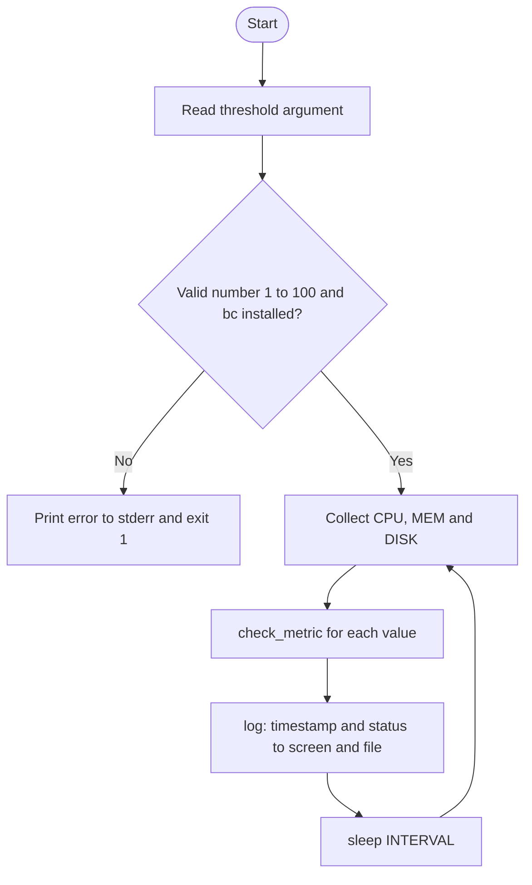

# PulseWatch

**A lightweight Linux server monitor written in Bash. It watches CPU, memory and disk, timestamps every reading, and flags anything above a configurable threshold.**


---

## Table of Contents

1. [Why PulseWatch](#why-pulsewatch)
2. [Features](#features)
3. [Quick Start](#quick-start)
4. [Usage](#usage)
5. [Sample Output](#sample-output)
6. [How It Works](#how-it-works)
7. [Design Decisions](#design-decisions)
8. [Testing](#testing)
9. [Known Limitations](#known-limitations)
10. [Roadmap](#roadmap)
11. [My Learning](#my-learning)

---

## Why PulseWatch

When a server runs out of CPU, memory or disk, the team usually finds out from users, not from the server. PulseWatch is a small, dependency-light monitor that checks the basics on a fixed interval and records what it saw with a timestamp, so there is always a trail to investigate.

It is also a learning project. I am building it step by step to practise DevOps fundamentals (Linux, Bash, Git, monitoring, alerting, cloud deployment) with professional engineering habits: small commits, tests, input validation and documented decisions.

## Features

- **CPU, memory and disk monitoring** in one loop
- **Configurable threshold** passed as a command-line argument (default `80`)
- **Input validation** with clear errors on stderr and meaningful exit codes
- **Dependency check** that fails fast if `bc` is missing
- **Timestamped logging** to the screen and to `pulsewatch.log` at the same time
- **One reusable status function** (`check_metric`) applied to every metric
- **Automated tests** covering valid input, invalid input and threshold behaviour

## Quick Start

**Requirements:** Linux (Ubuntu tested, including WSL2), Bash, and `bc`.

```bash
# 1. Clone
git clone git@github.com:Maryam-Ikhlaq-se/pulse-watch.git
cd pulse-watch

# 2. Install the one dependency
sudo apt install bc

# 3. Run
./monitor.sh
```

Stop the monitor at any time with `Ctrl + C`.

## Usage

```bash
./monitor.sh [threshold]
```

| Argument    | Description                                          | Default |
|-------------|------------------------------------------------------|---------|
| `threshold` | Whole number from 1 to 100. A metric above it is HIGH | `80`    |

```bash
./monitor.sh        # alert above 80%
./monitor.sh 90     # alert above 90%
./monitor.sh abc    # error: threshold must be a whole number from 1 to 100
```

**Exit codes**

| Code | Meaning                                        |
|------|------------------------------------------------|
| `0`  | Normal exit                                    |
| `1`  | Invalid threshold, or a required tool is missing |

Settings inside the script:

| Variable   | Purpose                         | Value             |
|------------|---------------------------------|-------------------|
| `INTERVAL` | Seconds between readings        | `5`               |
| `LOG_FILE` | Where readings are appended     | `pulsewatch.log`  |

## Sample Output

Default threshold on an idle machine:

```text
2026-10-09 17:40:58 CPU: 2% - NORMAL
2026-10-09 17:40:58 MEM: 5.9% - NORMAL
2026-10-09 17:40:58 DISK: 1% - NORMAL
```

With a low threshold (`./monitor.sh 1`) to prove the alert path works:

```text
2026-10-09 17:41:14 CPU: 1.1% - HIGH
2026-10-09 17:41:14 MEM: 5.9% - HIGH
2026-10-09 17:41:14 DISK: 1% - NORMAL
```

Invalid input:

```text
$ ./monitor.sh abc; echo $?
Error: threshold must be a whole number from 1 to 100.
Usage: ./monitor.sh [threshold]
1
```

## How It Works



**Code structure** (`monitor.sh`)

| Part             | Responsibility                                              |
|------------------|-------------------------------------------------------------|
| Validation block | Rejects bad thresholds and a missing `bc` before anything runs |
| `log()`          | Adds a timestamp and writes to screen and file with `tee -a` |
| `get_cpu()`      | Reads CPU usage as 100 minus idle, parsed from `top`         |
| `get_memory()`   | Reads used / total memory from `free` as a percentage        |
| `get_disk()`     | Reads root disk usage from `df /`                            |
| `check_metric()` | Compares a value to the threshold and logs HIGH or NORMAL    |
| Main loop        | Collects, checks, logs, sleeps                               |

**CPU pipeline explained**

```text
top -bn1                  one snapshot of system stats
| grep "Cpu(s)"           keep only the CPU line
| sed '...'               extract the idle percentage
| awk '{print 100 - $1}'  used = 100 - idle
```

## Design Decisions

| Decision | Why |
|----------|-----|
| **Functions per metric** | Each metric lives in one named place. Adding disk took a new function and two lines in the loop, with no change to the CPU or memory code (separation of concerns). |
| **`check_metric` instead of repeated `if` blocks** | One place decides HIGH or NORMAL for every metric (DRY). The future alert sender only needs to be added here. |
| **`bc -l` for comparisons** | Bash cannot compare decimals like `2.1`. `bc` can. |
| **Errors to stderr (`>&2`) and `exit 1`** | Keeps errors separate from normal output, and lets cron or other tools detect failure. |
| **Fail fast** | Bad input and missing dependencies are rejected at startup, not halfway through the loop. |
| **`10#` prefix on the threshold** | Stops Bash reading values like `08` as octal. |
| **`tee -a` logging** | Operators see readings live and the file keeps the history. |
| **Log files excluded by `.gitignore`** | Logs are generated data: they change constantly, grow without limit, and can leak server details into a public repo. |
| **Conventional Commits** | `feat:`, `fix:`, `refactor:`, `test:`, `docs:` keep the history readable and searchable. |

## Testing

Run the suite from the project folder:

```bash
./test.sh
```

| Test                          | Expectation                        |
|-------------------------------|------------------------------------|
| Non-numeric threshold (`abc`) | Rejected with exit code 1          |
| Threshold `0`                 | Rejected with exit code 1          |
| Threshold `101`               | Rejected with exit code 1          |
| Negative threshold (`-5`)     | Rejected with exit code 1          |
| Threshold `1`                 | MEM reported HIGH                  |
| Threshold `100`               | No HIGH reported                   |

The suite prints a PASS or FAIL line per test and a summary (`Passed: 6, Failed: 0`). It exits non-zero if any test fails, so it can be dropped into a CI pipeline later. `timeout 3` is used so the endless monitoring loop stops after one reading.

## Known Limitations

- **One threshold for all metrics.** Real teams use separate limits (for example disk 90%, CPU 80%). Per-metric configuration is planned.
- **WSL2 reports the Linux VM only.** On a laptop running WSL2, `top` sees processes inside Ubuntu, not Windows apps. On a real Linux server it covers the whole machine. The 1% disk reading is also a virtual disk.
- **`top` output parsing is format-dependent.** The `sed` expression assumes the standard procps `Cpu(s)` line found on Ubuntu.
- **Only the root filesystem (`/`) is checked.**
- **`pulsewatch.log` grows without limit.** Log rotation is planned.
- **Readings are logged but no alert is sent yet.** See the roadmap.

## Roadmap

- [x] Linux (WSL2), Git and GitHub with SSH authentication
- [x] CPU monitoring loop
- [x] Configurable threshold argument
- [x] Input validation and dependency check
- [x] Timestamps and log file
- [x] Memory and disk monitoring as separate functions
- [x] Shared `check_metric` function
- [x] Automated tests
- [ ] Per-metric thresholds in a config file
- [ ] WhatsApp alerts (what happened, which server, when, what to check first)
- [ ] Alert cooldown to prevent alert fatigue
- [ ] Secrets in a `.env` file kept out of Git
- [ ] Scheduled run with cron or systemd
- [ ] Log rotation
- [ ] Deployment on AWS EC2
- [ ] Architecture diagram and a screenshot of a real alert

---

## My Learning

This section is my engineering journal for the project: what I built, what broke, how I diagnosed it, and what it taught me.

### Journey so far

1. Set up Ubuntu on WSL2, installed and configured Git, created the GitHub repository.
2. Wrote the first CPU monitor and tested the NORMAL and HIGH paths.
3. Made the threshold a command-line argument.
4. Added validation, exit codes and a dependency check.
5. Added timestamps and file logging.
6. Refactored CPU into a function, then added memory and disk.
7. Introduced `check_metric` to remove duplicated logic.
8. Wrote an automated test script.
9. Wrote this README.

### Technical concepts I learned

**Linux and Bash**
- Shell scripting basics: variables, `while` loops, `if` blocks, functions and `local` variables.
- Parameter defaults with `"${1:-80}"`.
- Pipelines: how `top | grep | sed | awk` passes each step's output to the next.
- Why Bash cannot compare decimals, and how `bc -l` solves it.
- `stdout` versus `stderr`, and why errors go to `>&2`.
- Exit codes: `0` is success, anything else is failure, and `echo $?` reads the last one.
- Octal pitfalls: why `10#$VALUE` matters for numbers like `08`.
- `tee -a` for writing to screen and file at once.
- `command -v` for checking that a tool exists.
- `timeout` for stopping an endless loop inside a test.
- Heredocs (`cat > file << 'EOF'`) for writing a whole file from the terminal.

**Git and GitHub**
- Basic flow: `status`, `add`, `commit`, `push`, `log --oneline`.
- SSH authentication with an ed25519 key pair: the public key goes on GitHub, the private key never leaves the machine.
- Conventional Commits and writing in the imperative mood.
- `git commit -am` stages tracked, modified files only. New files still need `git add`.
- `.gitignore`: commit what you write, not what the program produces (logs) and never secrets.
- Do not rewrite pushed history just to fix a typo in a message.

**Monitoring concepts**
- CPU usage is 100 minus idle.
- Memory usage is used divided by total.
- A monitor you have never seen alert is untested, so always trigger the HIGH path on purpose.
- WSL2 is a lightweight VM, so it monitors Ubuntu, not Windows.

### Problems I hit and how I solved them

| Problem | Cause | Fix and lesson |
|---------|-------|----------------|
| `Permission denied (publickey)` on `git push` | GitHub had no SSH key for this machine | Generated an ed25519 key and added the public key to GitHub. Read the real error line, not the first scary one. |
| Typed a command into the `ssh-keygen` file-name prompt | Every prompt takes its own input | Commands go only at the `$` prompt. Cancel with `Ctrl+C` and restart. |
| `top: bad iterations argument` | Typed `-bnl` (letter L) instead of `-bn1` (number 1) | Letter `l` and number `1` look alike in a terminal font. Read error messages literally. |
| `awk` printed wrong values | Typed `$l` instead of `$1` | Same look-alike problem. |
| `sed: unknown command` and an empty CPU value | A `'...'` placeholder was left in the `sed` expression | Never leave placeholders. Always test after every edit. |
| Garbled lines and a stray `EOF` in the file | Pasted a heredoc inside nano instead of at the `$` prompt | Know which program has focus before pasting. Replace the file from the prompt. |
| `syntax error: unexpected end of file` | Missing closing `}` on a function | Every `{` needs a `}`. Read the line number in the error. |
| A pipe character in front of a log message | A stray `\|` made Bash treat the text as a command | Re-read code character by character when behaviour is odd. |
| `sudo apt insatll bc` in an error message | Typo in a message users will copy and paste | Messages are part of the product. Proofread them. |
| `df -h/` returned `invalid option` | Missing space before `/` | Spacing matters in the shell. |
| `DISK: 1% - NORMAL` at threshold 1 | The check is strictly greater than: 1 is not above 1 | My expectation was wrong, not the code. Check the rule before blaming the program. |
| `cat pulsewatch.log` said no such file | I had said "done" before the logging code existed | Do not assume a step is finished. Verify with evidence (output, `git status`, `git log`). |
| Typo "continous" in an early commit | Skipped proofreading | Fix forward. Proofread messages from then on. |

### Software engineering practices I applied

- **Incremental delivery:** one small change, one test, one commit.
- **Test before commit:** a commit should never contain a script I have not seen working.
- **Fail fast and fail loudly:** validate input early, return clear errors and exit codes.
- **Separation of concerns:** each metric in its own function.
- **DRY:** one status function instead of copy-pasted blocks.
- **Reliability thinking:** dependency checks, edge-case tests (0, 101, negative, text).
- **Security hygiene:** SSH keys instead of passwords, logs and future API keys kept out of Git.
- **Honest documentation:** a Known Limitations section instead of overselling.

### What this project taught me

- Debugging is a method: read the exact error, find the line, form a hypothesis, test one change.
- Small steps with proof beat big steps with hope. Most of my bugs were typos, and frequent testing caught each one within a minute.
- Tools lie by omission. A script can run without errors and still measure the wrong thing (WSL monitoring only the Linux VM).
- Good alerts are a design problem too. A message must tell a tired person what happened, where, when and what to check first, and must not fire a hundred times for one spike.
- Documentation and commit history are part of the deliverable, not an afterthought.

### Next learning goals

- HCI-driven alert design for WhatsApp messages
- Working with REST APIs and keeping secrets out of source control
- Scheduling with cron and systemd, and log rotation
- Deploying and running the monitor on AWS EC2

---

**Author:** Maryam Ikhlaq  
Built as part of a DevOps and AWS Cloud learning path.
